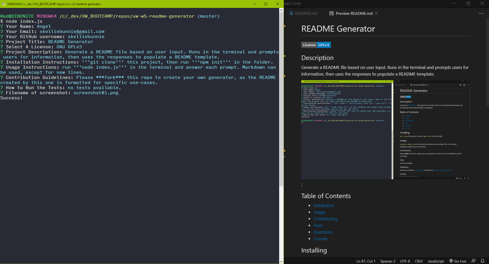

# README Generator
[](https://www.gnu.org/licenses/gpl-3.0)

## Description
Generate a README file based on user input. Runs in the terminal and prompts the user for information, which is then populated to a README template.



[](https://drive.google.com/file/d/1L3fjmJZ_XDWcdUnJudcz3A4L6O1_HvZF/view)

*Click the GIF above to view it full-size on Google Drive.*

## Table of Contents
* [Installation](#Installation)
* [Usage](#Usage)
* [Contributing](#Contributing)
* [Tests](#Tests)
* [Questions](#Questions)
* [License](#License)

## Installing
- ```git clone``` this repo
- run ```npm init``` in the terminal

## Usage
run ```node index.js``` in the terminal and answer each prompt as thoroughly as possible. Markdown can be used, except for new lines.

### Contributing
Please ***fork*** this repo to create your own generator. The README created by this generator is formatted for specific use-cases.

### Tests
no tests available

### Questions
- Find me on Github: [skelliebunnie](https://github.com/skelliebunnie)
- Email me at: skelliebunnie@gmail.com

### License
Copyright (C) 2021 Angel

This program is free software: you can redistribute it and/or modify
it under the terms of the GNU General Public License as published by
the Free Software Foundation, either version 3 of the License, or
(at your option) any later version.

This program is distributed in the hope that it will be useful,
but WITHOUT ANY WARRANTY; without even the implied warranty of
MERCHANTABILITY or FITNESS FOR A PARTICULAR PURPOSE.  See the
GNU General Public License for more details.

You should have received a copy of the GNU General Public License
along with this program.  If not, see https://www.gnu.org/licenses/gpl-3.0.